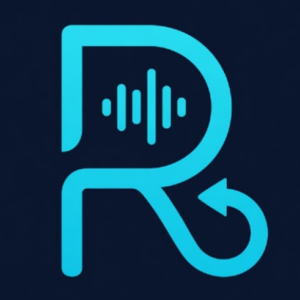

<p align="center">
  
</p>

<h1 align="center">Recallly</h1>

<p align="center">
  <strong>AI-powered voice notes for field professionals</strong><br>
  Record. Transcribe. Extract. Done.
</p>

<p align="center">
  
  
  
  
  
</p>

<p align="center">
  <!-- <a href="#"></a> -->
  <em>Currently in closed testing on Google Play — public release coming soon.</em>
</p>

---

## About

Recallly is a native Android app built for **Sales Reps**, **Field Engineers**, and **Insurance Adjusters** who spend their day in the field and hate manual CRM data entry.

Tap the mic, talk naturally about your visit, and Recallly handles the rest — transcribing your voice note and extracting structured CRM fields using AI. Everything works **offline-first** with no cloud database dependency.

## Key Features

### Voice Recording & Dual-Mode Transcription
- **Online mode** — Android `SpeechRecognizer` with real-time partial results
- **Offline mode** — On-device [whisper.cpp](https://github.com/ggerganov/whisper.cpp) via JNI (no internet required)
- Automatic mode selection based on network connectivity
- Silence detection for hands-free auto-stop

### AI Field Extraction
- **Gemini 2.5 Flash** extracts structured fields from transcripts (company name, contact info, next steps, deal value, etc.)
- Persona-specific prompts tailor extraction to your role
- Background extraction via WorkManager — close the app and results appear later
- Custom fields — define your own fields and they're included in extraction

### Smart Onboarding
- Choose your **persona** (Sales Rep, Field Engineer, Insurance Adjuster)
- Toggle which **CRM fields** matter to you
- Set your **work schedule** and get reminder notifications
- Select your **language** (English, Arabic, Spanish, Turkish)

### Export & Integrations
- **PDF export** with localized field names — share reports instantly
- **Calendar integration** for scheduling follow-ups from voice notes
- Full **RTL support** for Arabic

### Offline-First Architecture
- Voice notes stored locally as JSON — no cloud sync required
- On-device Whisper model downloaded once (~142 MB), runs entirely offline
- DataStore preferences for all user settings
- Works without internet after initial setup

## Tech Stack

| Layer | Technology |
|-------|-----------|
| UI | Jetpack Compose + Material 3 |
| Architecture | Clean Architecture + MVVM + UDF |
| DI | Koin |
| Database | Room |
| Preferences | DataStore |
| Navigation | Navigation Compose (type-safe routes) |
| Auth | Firebase Auth + Credential Manager |
| AI | Google Generative AI (Gemini 2.5 Flash) |
| Speech | whisper.cpp (C/C++ via JNI) + Android SpeechRecognizer |
| Background | WorkManager |
| Billing | Google Play Billing |
| Language | Kotlin 2.3.10, 100% Kotlin |

## Building

### Prerequisites

- Android Studio Ladybug or later
- JDK 11+
- NDK r26.3 (`26.3.11579264`) — install via SDK Manager
- CMake 3.22.1+

### Setup

1. **Clone the repository**
   ```bash
   git clone https://github.com/7pak/Recallly.git
   cd Recallly
   git submodule update --init --recursive
   ```

2. **Create `local.properties`** in the project root with your keys:
   ```properties
   WEB_CLIENT_ID=your-firebase-oauth-client-id
   GEMINI_API_KEY=your-gemini-api-key
   ```

3. **Add `google-services.json`** from your Firebase project to `app/`.

4. **Build**
   ```bash
   ./gradlew assembleDebug
   ```
   On Windows, use `gradlew.bat` instead of `./gradlew`.

### Optional Build Config

These keys have working defaults (test IDs) but can be overridden in `local.properties`:

```properties
ADMOB_APP_ID=your-admob-app-id
ADMOB_REWARDED_PRE_RECORD_ID=your-ad-unit-id
ADMOB_REWARDED_POST_SAVE_ID=your-ad-unit-id
BILLING_SUBSCRIPTION_ID=your-subscription-product-id
```

## Architecture

```
com.at.recallly/
├── core/           # DI, theme, utilities, Result<T>
├── data/           # Repositories, Room, DataStore, Whisper, Gemini, Billing, Ads
├── domain/         # Models, repository interfaces, use cases (pure Kotlin)
└── presentation/   # Compose screens, ViewModels, navigation
```

The app follows **Clean Architecture** with strict layer separation. The domain layer has zero Android dependencies. ViewModels expose a single `StateFlow<UiState>` and accept sealed `UiEvent` interfaces for unidirectional data flow.

See [CLAUDE.md](CLAUDE.md) for detailed architectural documentation.

## Supported Languages

| Language | Code | Direction |
|----------|------|-----------|
| English | `en` | LTR |
| Arabic | `ar` | RTL |
| Spanish | `es` | LTR |
| Turkish | `tr` | LTR |

## License

All rights reserved. This source code is provided for reference and educational purposes only. See the [LICENSE](LICENSE) file for details.

---

<p align="center">
  Built with Kotlin and Jetpack Compose
</p>
